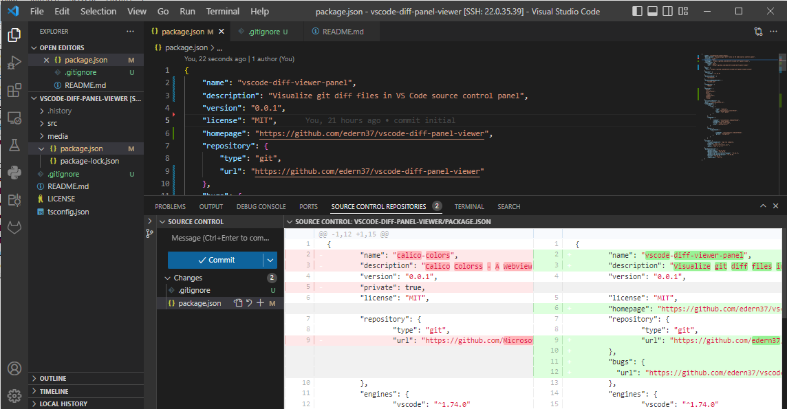
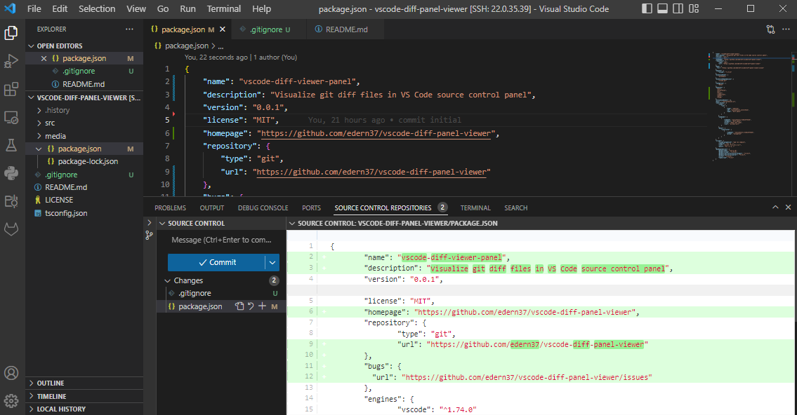

# Vscode diff panel viewer

View git diff in a panel next source control when file is clicked in source control (use [diff2html](https://github.com/rtfpessoa/diff2html)).

## Demo

### With left and right diff panel:

  

### Without left diff panel:

  

## Features

- Ctrl + click inside webview to open file in editor at given line.
- Open/Close left part of diff
- Autoclose diff file in editor when clicked in Source control

## Running the extension

- Open this example in VS Code 1.49+
- `npm install`
- `npm run watch` or `npm run compile`
- `F5` to start debugging

In the explorer, expand the `Calico Colors` view.

## Contribute

All contributions are welcome, so don't hesitate to submit a pull request. ;-)

## License

This code is released under MIT License.

Check [LICENSE](LICENSE) file for more information.
